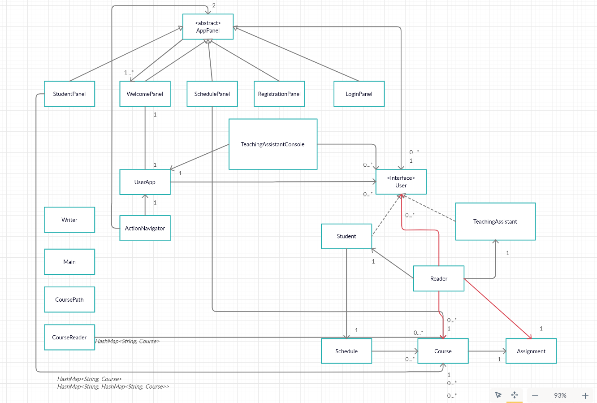

# University Service Center

(Source: https://images.app.goo.gl/tB36itRUvU18vmu3A)

(Background images: https://wallpapercave.com/wp/wp2394204.jpg, https://wallpapercave.com/wp/wp2394333.jpg, https://wallpapercave.com/wp/wp2394208.jpg, https://images.app.goo.gl/gmM4wixSVX1LbkTg8, https://wallpapercave.com/w/wp7167423, https://images.app.goo.gl/KDjafwxifwGpHy1V9)

## An application that helps students to select courses and TAs to grade students.

University Service Center always strives to provide a welcoming, professional, and safe environment for 
all the students, parents, alumni, and faculty members. When I first became a freshman in *UBC*, I felt overwhelmingly 
stressful to look into and absorb all the information on the website in case I miss something important. However, *UBC* 
manages to render the whole process simple and straightforward by utilizing the descriptive and comprehensible entries
as well as informative structures on the website. From my perspective as a current enrolled student, I just enjoy the 
experience using the websites. Thus, software engineers did an outstanding job on this, and it obviously deserves me
to learn from them.  

- *Why this project is of interest to you?*

As for my personal project, it strikes me that it would be fun to figure out the mechanism behind the university 
service center, and the best way to understand something is to implement it. A wide range of people such as students and 
TAs can benefit from using my application. They would save a large amount of energy and time if this application is 
handy. Therefore, it is intriguing to build this project and share it on Github.
- *What will the application do?*

This application **aims** to mimic only a small portion of the behaviors which *UBC Student Service Center* exhibits 
such as registering courses. In addition, the 
project is expected to modify and improve some functions provided by *UBC Student Service Center*. As a *UBC*
student, you may experience the situation that you want to register a course, but you have not met the prerequisites. 
That can be frustrating sometimes. In this application, a 
student who pursues a specific specialization can design his/her course pathways based on current registered courses 
instead of checking back and forth for prerequisites of each course.
Also, you are able to save these pathways (course selections) according to your career plans. Some gadgets could 
be further implemented to improve the user experience. If you are identified as a teaching assistant rather than a 
student, 
you can grade students by a simple grade calculator. It is available to create a grading scheme for each of the
student in the same class. These functions will make grading effective and efficient since TAs only need to type in the
grades for each assignment and exam. 
- *Who will use it?*

This application targets current *UBC* students and TAs. It can be customized to refine students' experience when 
selecting optimal courses and TAs' counterpart when grading assignments.

Hopefully, this application will hone my software constructing skills (Java programming).

### Phase 1 - User Stories

In the context of this application:
> - As a user (student), I want to be able to add multiple courses to a schedule. 
> - As a user (student), I want to be able to view all the prerequisites of the current course selection.
> - As a user (student), I want to be able to delete a course from a schedule. 
> - As a user (student), I want to be able to view the detail of the course and schedule.
> - As a user (student), I want to be able to view grades of the assignments.
> - As a user (TA), I want to be able to see an array of students' ID in the given class to protect privacy.
> - As a user (TA), I want to add multiple assignments to student and grade them.
> - As a user (TA), I want to remove multiple assignments from a student. 
> - As a user (TA), I want to see the course that students have registered.
> - As a user (TA/Student), I want to sign up and login with my name and number. 

### Phase 2 - User Stories

> - As a user (Student), I want to save the courses that I have selected in the schedule to a file.
> - As a user (TA), I want to save all the grading status of an assignment to a file.
> - As a user (Student/TA), I want to be able to clear the existing users' data.
> - As a user (Student/TA), I want to be able to auto-save the existing state when I end the program.
> - As a user (Student/TA), I want to load all the users' data to the program automatically when the application starts.

### Instructions for Grader

- You can browse all the courses in the database. If you click a course name, you can see the course detail accordingly.
- You can generate the first required event by clicking the course name.
- You can generate the second required event by clicking add to my schedule button.
- You can view your schedule by clicking the `view schedule` button.
- You can locate my visual component by running the main class. There will be a nice background image for the welcome interface.
- If you add a course to your schedule successfully, you will see the information in the panel.
- When you log in or register my application, you will be confirmed by pop-up windows. 
- You can save the state of my application by clicking `save` or `save and exit` button.
- You can reload the state of my application by reopening my application. All the data will be loaded automatically.

### Phase 4: Task 2

- In my `Assignment` class, method `createAssignment` throws checked out weight bound exception and negative value exception.
Another method `gradeAssignment` throws checked out grade bound exception and negative value exception. They have been thoroughly tested and can be considered as robust design. 
- My `User` interface has been implemented by classes `Student` and `TeachingAssistant`. The getters and setters have been overridden. (Type hierarchy)
- Class `CourseReader` reads a html file and constructs a list of courses. In light of the introduction of a map, I utilize the Map interface (a hashmap) to store all the courses.
Also in my `StudentPanel`, map has been used intensively because I need to search a course by its ID. The courses I get from Class `CourseReader` is a Hashmap<String, Course>. In addition,
I store the data as Hashmap<String, Hashmap<String, Course>> where the first string is a faculty name.

### Phase 4: Task 3

- Poor cohesion in `UserApp` class.
  + Specification: This class fails to conform single responsibility principle because it incorporates all the functionality relating to teaching assistant user interface.
  This class should only include the functions to save the current state and read it from a JSON file encompassing all the users' information.
  + *Change*: Extract all the methods contributing to teaching assistant interface and put them in a new class named `TeachingAssistantConsole`. In this way,
  `UserApp` concentrates on a single responsibility, thus increasing the cohesion of this class. 
  
- High coupling in `Reader` class.
  + Specification: This class has declared too many fields that can be regard as unnecessary. Too many fields cause redundant associations with other class.
  + *Change*: To improve it, I try to transform some fields into local variables to decrease coupling in this particular class (It is shown in UML diagram below).

